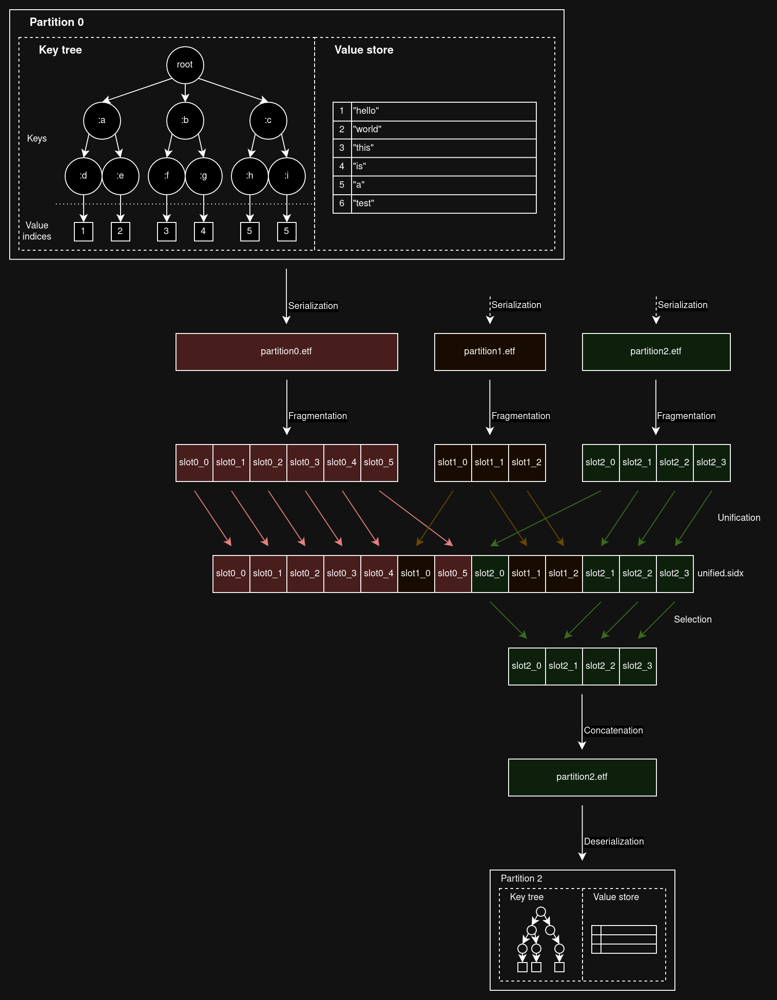

# Subindex
Simple key-value store with subindex support for the BEAM implemented in pure
Elixir. Mainly intended to be used by the
[markov](https://github.com/portasynthinca3/markov) library.

## Goals
This database was created for a very specific purpose - to support the
aforementioned markov library, which in turn powers the
[Deuterium](https://github.com/portasynthinca3/deutexrium) Discord bot. It
strives to achieve the following goals:
  - Integrated into the BEAM VM as its own OTP app.
  - Write speed at the expense of durability; this is because Deuterium receives
  about 10 write requests for every read request.
  - Support for "subindexing", or partial keys.
  - No need for entire tables to be loaded into memory; this requirement arose
  after trying `ets` and `mnesia`.

## Installation
```elixir
defp deps do
  [
    {:sidx, "~> 0.1"}
  ]
end
```

## Usage
Example workflow:
```elixir
# loads table at "./path" or creates one if it doesn't exist
table = Sidx.open!("./path", keys: 3)

:ok = Sidx.insert(table, [:a, :b, :c], :d) # the 3 keys and a value
:ok = Sidx.insert(table, [:e, :f, :g], :h)
:ok = Sidx.insert(table, [:e, :f, :i], :j)
:ok = Sidx.insert(table, [:e, :k, :l], :m)

Sidx.select(table, [:a, :b, :c]) # {:ok, [{[], :d}]}
Sidx.select(table, [:e, :f, :g]) # {:ok, [{[], :h}]}
Sidx.select(table, [:e, :f, :i]) # {:ok, [{[], :j}]}
Sidx.select(table, [:e, :f])     # {:ok, [{[:g], :h}, {[:i], :j}]}
Sidx.select(table, [:e, :k])     # {:ok, [{[:l], :m}]}
Sidx.select(table, [:e])         # {:ok, [
                                 #   {[:g, :f], :h}   # subkeys in reverse order
                                 #   {[:i, :f], :j},
                                 #   {[:l, :k], :m}]
                                 # }

# inserts with keys to an existing row overwrite the value
:ok = Sidx.insert(table, [:a, :b, :c], 0)
Sidx.select(table, [:a, :b, :c]) # {:ok, [{[], 0}]}

# update is atomic and more efficient than select+insert
Sidx.update(table, [:a, :b, :c], fn _path, value -> value + 1 end)
Sidx.select(table, [:a, :b, :c]) # {:ok, [{[], 1}]}

Sidx.close!(table)
```

## Inner workings
  - The database is partitioned by the first key in the key list
  - Every partition consists of a **key tree** and a **value store**
  - Partitions are **serialized** into a binary
  - A serialized partition is **fragmented** into equally-sized **slots**
  - Multiple serialized partitions' slots are intertwined and put into one file
  in a process called **unification**
  - When a partition needs to be read from disk, the unifier will first
  **collect** the slots corresponding to that partition which will then be
  **concatenated** and finally **deserialized**



## Results
This database has achieved the required performance target, however it fails to
fail gracefully. A sudden stop of the VM or an interruption of the writing
process leads to a corrupted database. Ideally, this should not happen, however
it is by design _okay_ to lose writes in such an event.
